# Programação Assistida por IA com Amazon CodeWhisperer

Hoje, as ferramentas de desenvolvimento de software alimentadas por inteligência artificial estão permitindo que as pessoas construam soluções de software usando a mesma linguagem utilizada ao falar com outras pessoas. 
Essas ferramentas alimentadas por IA traduzem a linguagem natural para as linguagens de programação que os computadores entendem.  

A IA auxilia na programação em várias formas:

1. **Assistência de escrita de código**: Sugerindo trechos de código, completando linhas ou gerando código-fonte com base nas especificações do programador.
2. **Detecção de erros e depuração**: Analisando o código para identificar bugs, erros e vulnerabilidades, fornecendo sugestões de correção.
3. **Tradução de linguagens de programação**: Convertendo código entre diferentes linguagens para facilitar o desenvolvimento em ambientes familiares.
4. **Otimização de desempenho**: Sugerindo melhorias no código para torná-lo mais eficiente e econômico em recursos.
5. **Geração automática de testes**: Criando casos de teste automatizados para garantir o correto funcionamento do software.
6. **Análise de código legado**: Compreendendo sistemas antigos para auxiliar em sua manutenção e atualização.
7. **Extração de informações e insights**: Analisando grandes volumes de código para obter informações úteis, identificar padrões e melhorar a qualidade geral do código.

Exemplos de ferramentas de Programação Assistida por IA:

- <a href="https://aws.amazon.com/codewhisperer/">**Amazon CodeWhisperer**</a>
- <a href="https://github.com/features/copilot">**GitHub Copilot**</a>
- <a href="https://www.useblackbox.io/">**Blackbox**</a>
- <a href="https://www.tabnine.com/">**Tabnine**</a>
- <a href="https://www.easycode.ai/">**EasyCode**</a>
- <a href="https://codegeex.cn/">**CodeGeex**</a>

Em resumo, a programação assistida por IA é a aplicação de inteligência artificial para auxiliar os desenvolvedores de software em várias tarefas, como sugerir código, detectar erros, traduzir linguagens, otimizar o desempenho, gerar testes automatizados, analisar código legado e extrair informações úteis. Ela visa tornar o desenvolvimento mais produtivo e eficiente.

-----

# Amazon CodeWhisperer

- O Amazon CodeWhisperer é um gerador de código de uso geral baseado em machine learning que fornece recomendações de código em tempo real.
- À medida que você escreve código, gera CodeWhisperer automaticamente sugestões com base no código e nos comentários existentes. 
- As recomendações personalizadas podem variar em tamanho e escopo, abrangendo desde um comentário de uma única linha até funções totalmente formadas.
- O CodeWhisperer também pode escanear seu código para destacar e definir problemas de segurança.
- O CodeWhisperer suporta geração de código para 15 linguagens de programação. A precisão e qualidade da geração de código para uma linguagem de programação depende do tamanho e qualidade dos dados de treinamento.
- Linguagens Suportadas:
1. Em termos da qualidade dos dados de treinamento, as linguagens de programação com maior suporte são: Java, Python, JavaScript, TypeScript e C#.
2. O CodeWhisperer também suporta geração de código para as seguintes linguagens: Ruby, Go, PHP, C++, C, Shell, Scala, Rust, Kotlin e SQL.
- Otimizado para uso com os serviços da AWS: O CodeWhisperer torna o uso dos serviços da AWS mais eficiente para os desenvolvedores, fornecendo sugestões de código otimizadas para APIs da AWS, incluindo Amazon Elastic Compute Cloud (Amazon EC2), AWS Lambda e Amazon Simple Storage Service (Amazon S3). Conforme você escreve código no seu IDE, o CodeWhisperer analisa automaticamente esse código e seus comentários.

### AWS Toolkit for IntelliJ IDEA

- A JetBrains é uma empresa de software que desenvolve várias IDEs (Ambientes Integrados de Desenvolvimento).
- O CodeWhisperer suporta todas as IDEs da JetBrains, com exceção da JetBrains Gateway.
- O CodeWhisperer é executado nas IDEs da JetBrains por meio do AWS Toolkit, que é uma extensão da JetBrains.  

### Instalando o AWS Toolkit para IntelliJ IDEA (for Java development)

1. No menu principal da JetBrains: *File > Preferences > Plugins > Marketplace > AWS Toolkit*

 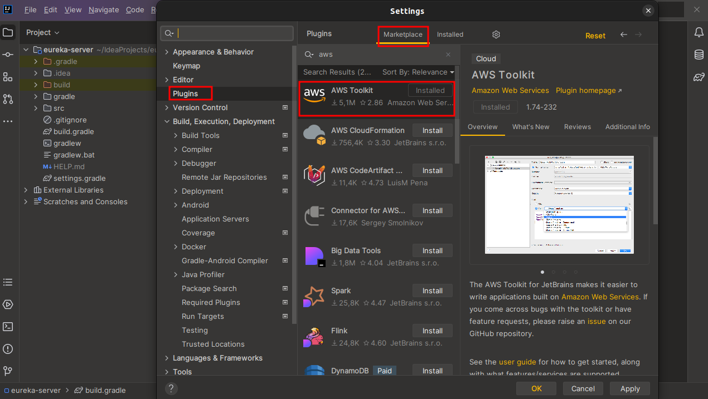 

2. **Restart** a IDE

 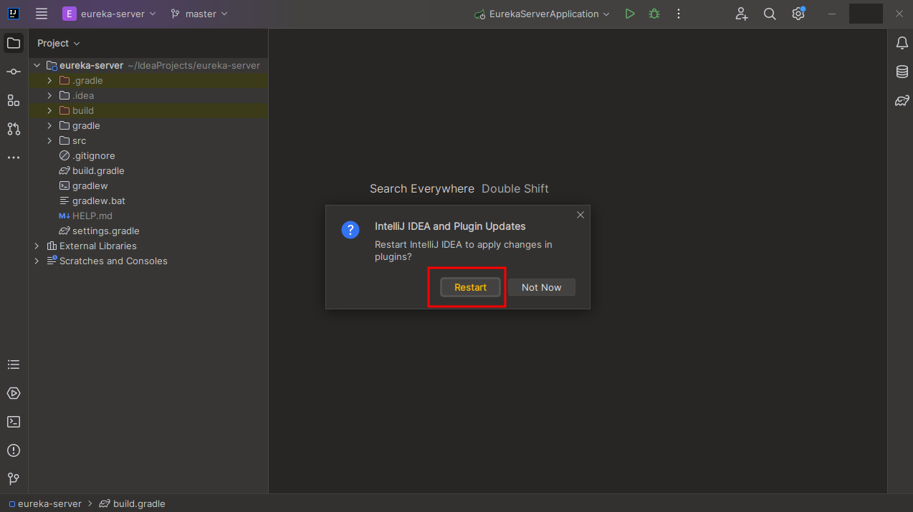

3. Conectando o CodeWhisperer com **AWS Builder ID**
   
- No canto superior esquerdo irá aparecer a logo da ferramenta da AWS. Clique nela. Abrirá uma janela abaixo no canto inferior esquerdo: *Developer Tools > CodeWhisperer > Start*

 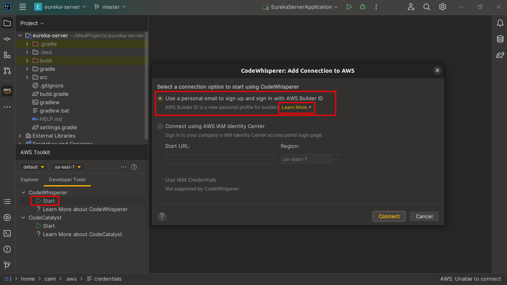

- Agora faça o Login com AWS Builder ID. Clique no botão **Open and Copy Code**

 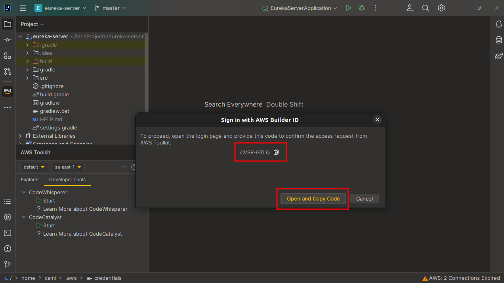

4. Você será redirecionado para **fazer o login no AWS Builder**.

- **Autorize a requisição** para conectar sua IDE com a AWS

 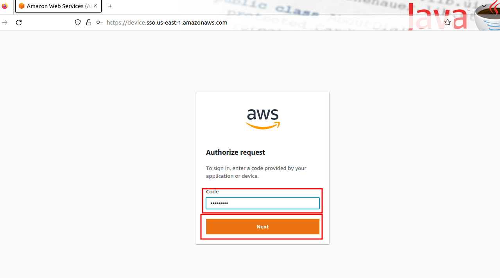

- Você poderá **criar um AWS Builder ID ou fazer o login caso já tenha**

 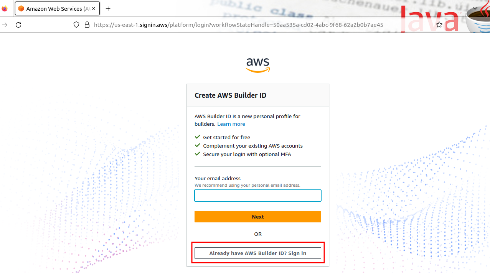

- Insira seu **endereço de email cadastrado > Next**

 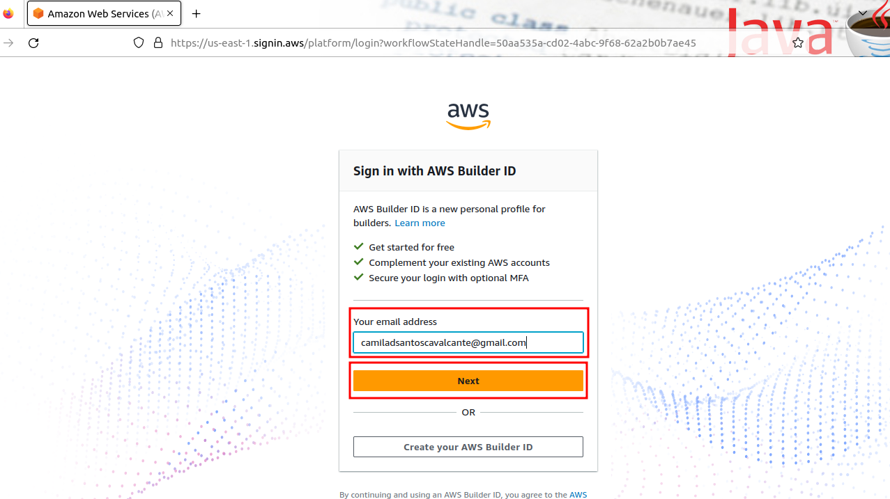

- Insira um **nickname > Next**

 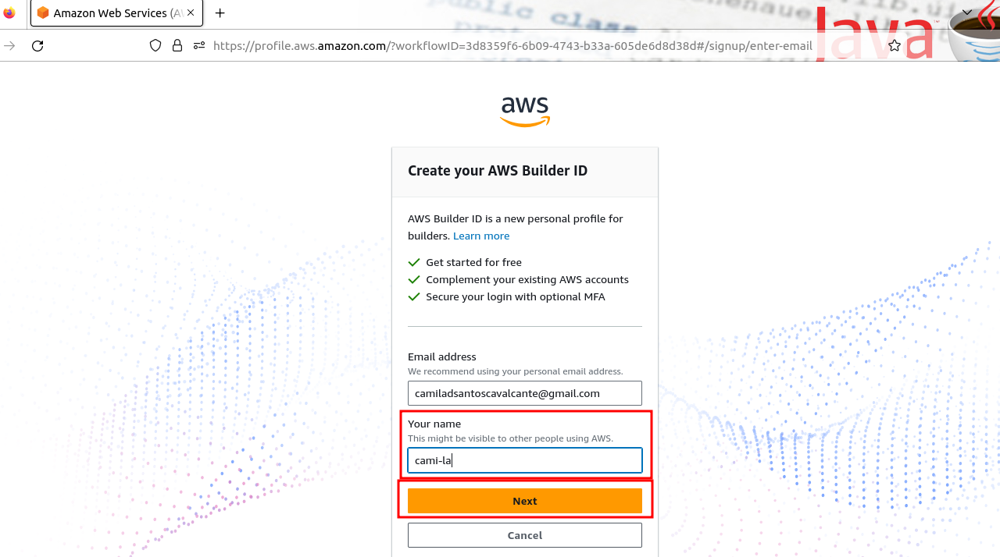

- Insira o **código de verifição que você recebeu no e-mail > Verify**

 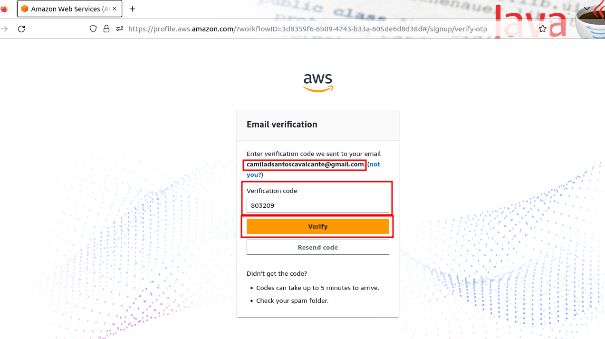

- Com seu e-mail verificado: **Insira a Password > Confirm password > Create AWS Builder ID**

 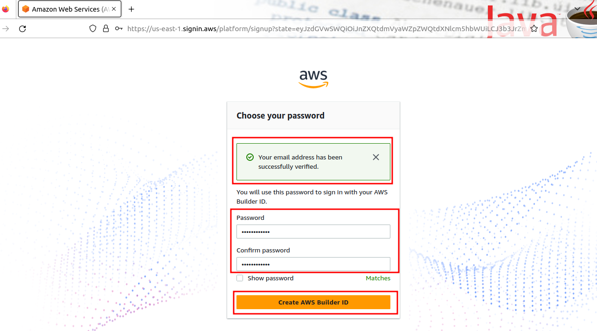

- Permita a AWS acessar seus dados: **Allow**

 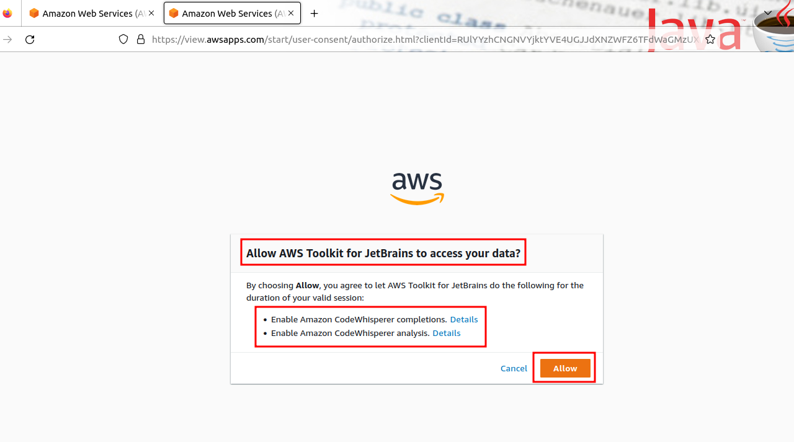

- Pronto! **Agora você poderá utilizar o AWS Toolkit no IntelliJ**

 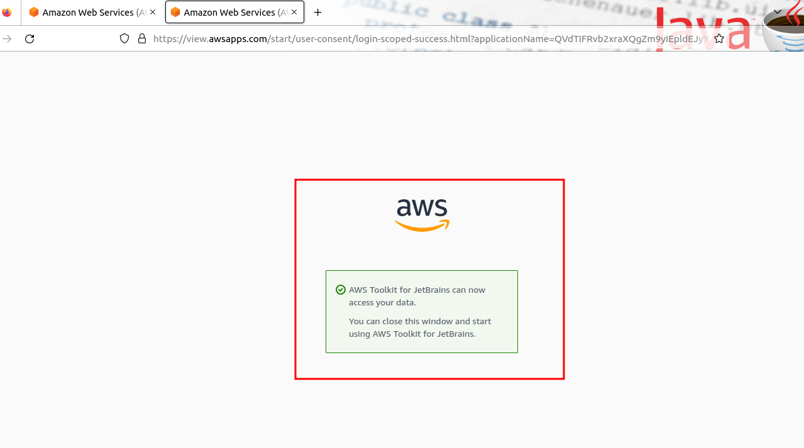

5. De volta ao IntelliJ IDEA
   
- Permaneça conectado no CodeWhisperer com AWS Builder ID. Clique em **Yes**

 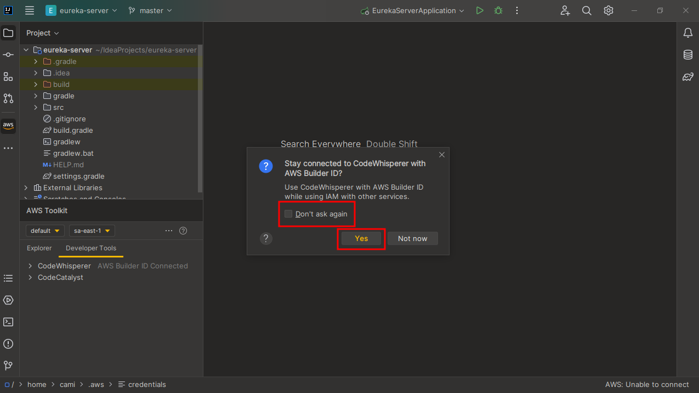

- Observe que o **CodeWhisperer já está funcionando**

 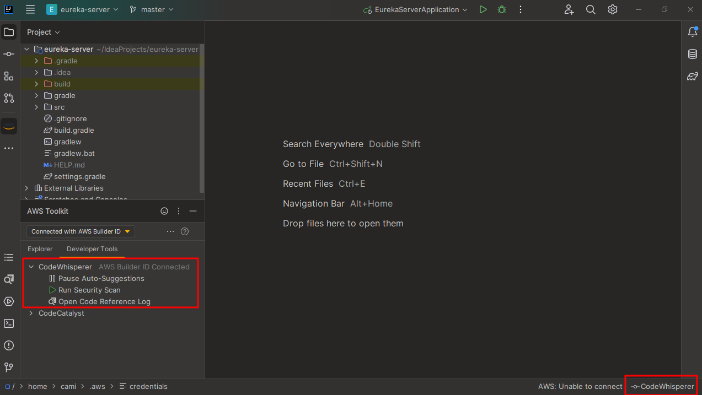

- Entre nas configurações do CodeWhisperer e selecione todas as opções. *File > Preferences > AWS > CodeWhisperer* (No meu caso, apenas a primeira não estava selecionada)

 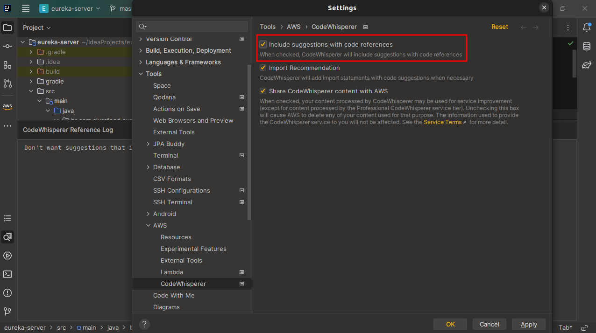

# MER da API Todo-List

 
MER Todo-List

- `TodoList` possui (contém) um ou mais relacionamentos com `TodoItem`.
- `TodoItem` possui (é parte de) um relacionamento com `TodoList`.

### Estrutura do Projeto Spring Boot

- **APIs REST**: O cliente envia solicitações ao servidor como dados. O servidor usa essa entrada do cliente para iniciar funções internas e retorna os dados de saída ao cliente.
- **Spring Boot** é um framework Java open source ele traz mais agilidade para o processo de desenvolvimento, uma vez que devs conseguem reduzir o tempo gasto com as configurações iniciais.
- **A arquitetura em três camadas** tem por objetivo promover a separação das funcionalidades usando camadas para a separação da lógica de apresentação, lógica de negócio e lógica de acesso a dados.

<a href="https://docs.google.com/presentation/d/1EqXeBjRW_84mSfTJpYUK63QPi2O0aeK5/edit?usp=sharing&ouid=101340348592910912358&rtpof=true&sd=true">Arquitetura de Três Camadas</a> 

-----

### Referências

[1] "Vídeo sobre Programação Assistida por IA." YouTube. Disponível em: https://www.youtube.com/watch?v=0PpmtFfh3HI&t=3175s.

[2] "Como a IA facilita a vida dos desenvolvedores e ajuda todos a aprender sobre desenvolvimento de software." Microsoft News. Disponível em: https://news.microsoft.com/pt-br/como-a-ia-facilita-a-vida-dos-desenvolvedores-e-ajuda-todos-a-aprender-sobre-desenvolvimento-de-software/.

[3] "CodeWhisperer - AWS Toolkit for Visual Studio Code." AWS Documentation. Disponível em: https://docs.aws.amazon.com/pt_br/toolkit-for-vscode/latest/userguide/codewhisperer.html.

[4] "CodeWhisperer - Language IDE Support." AWS Documentation. Disponível em: https://docs.aws.amazon.com/codewhisperer/latest/userguide/language-ide-support.html#language-support.

[5] "AWS CodeWhisperer - Recursos." Amazon Web Services. Disponível em: https://aws.amazon.com/pt/codewhisperer/features/.

[6] "AWS Toolkit for JetBrains." AWS Documentation. Disponível em: https://docs.aws.amazon.com/toolkit-for-jetbrains/latest/userguide/welcome.html.

[7] "AWS Toolkit for IntelliJ." Amazon Web Services. Disponível em: https://aws.amazon.com/intellij/.

[8] "Spring Boot." Projeto Spring Boot. Disponível em: https://spring.io/projects/spring-boot.

[9] Apresentação sobre "Contextualizando o Desenvolvimento Web com Spring Boot 3 e Kotlin". Disponível em: https://docs.google.com/presentation/d/1EqXeBjRW_84mSfTJpYUK63QPi2O0aeK5/edit?usp=sharing&ouid=101340348592910912358&rtpof=true&sd=true.

## Autor

 

Feito com ❤️ por <a href="https://www.instagram.com/camimi_la/" title="Instagram">Cami-la </a> 👋🏽 